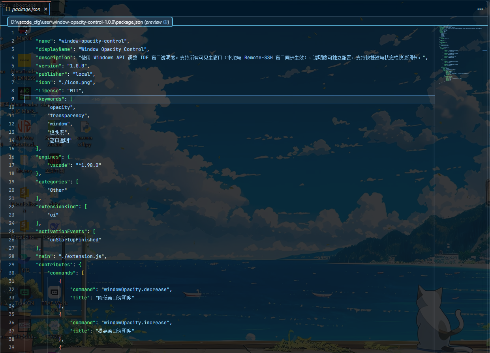

# Window Opacity Control

使用 Windows API 调整 IDE 窗口透明度的 VS Code 扩展。

- 纯 Win32 API（`user32.dll`），不依赖任何第三方库
- 所有可见主窗口生效：本地与 Remote-SSH 窗口同步调整
- 透明度 0 ~ 255 独立配置，重启自动恢复
- 快捷键 + 状态栏快速调节

## 效果预览



## 安装

**A. VS Code 扩展（.vsix）**

```
code --install-extension window-opacity-control-<ver>.vsix
```

→ Reload Window 即可。

**B. 从源码构建**

```
build.cmd        # 打包 extension/ -> dist/*.vsix 并自动安装
```

## 使用说明

功能特性、快捷键、状态栏与设置项详见 [extension/README.md](extension/README.md)。

## 源码结构

```
extension/        # VS Code 扩展（package.json / extension.js / README / icon / 效果图）
vsix/             # vsix 打包模板（extension.vsixmanifest / [Content_Types].xml）
build.cmd         # 打包 -> 自动安装
dist/             # 打包产物（.vsix，不入库）
```

版本升级：同步修改 `extension/package.json` 的 `version` 和 `build.cmd` 的 `VER`。
